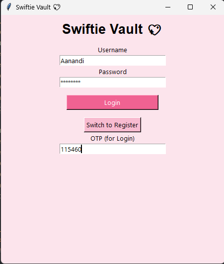
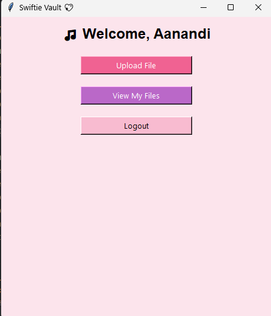
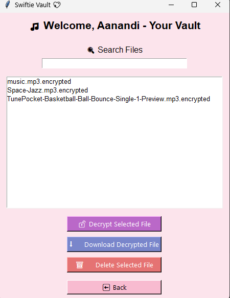
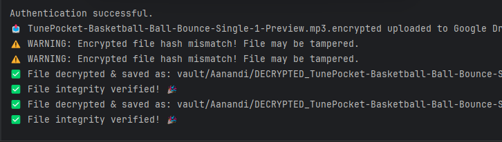

# 🎵 Swiftie Vault 🩷

A secure file vault inspired by Music Creation, built using Python.  
It encrypts your mp3 files with AES-256, verifies them with SHA-256, and stores them on Google Drive — all protected with OTP-based two-factor authentication.

---

## ✨ Motivation

I often imagined how artists might protect their unreleased music — which often gets leaked. While cloud services offer convenience, they often fall short on **true data privacy and integrity** — especially for individuals who need more than just a password.  

That's how **Swiftie Vault** was born — a love letter to secure storage, privacy, and my favorite artist 💗

---

## 🔐 Features

- 🔐 **User Authentication** with `bcrypt`
- 📧 **Email-based OTP Verification (2FA)**
- 🔒 **AES-256 File Encryption**
- ☁️ **Google Drive Upload**
- 🧾 **SHA-256 File Integrity Verification**
- 📩 **Forgot Password via OTP**
- 🖼️ **Aesthetically Pleasing GUI with File Vault Interface**
- 🧠 **Modular Code Structure** (`auth.py`, `user.py`, `encryption.py`, `google_drive.py`, etc.)

---

## 🛠️ Tech Stack

- 🐍 Python 3
- 🔐 PyCryptodome (AES)
- ☁️ PyDrive2 (Google Drive API)
- ✉️ Gmail SMTP (for OTP)
- 📁 JSON (for user data)

---

## 💡 Why Swiftie Vault is Unique

Unlike generic cloud storage or traditional file lockers, **Swiftie Vault is designed with high-profile artists in mind** — think Taylor Swift storing unreleased tracks or lyrics securely.

| Feature                        | Cloud Drives (Google Drive, Dropbox) | Swiftie Vault            |
|-------------------------------|--------------------------------------|--------------------------|
| End-to-End Encryption         | ❌                                    | ✅ AES-256               |
| Two-Factor Authentication     | ⚠️ Optional                           | ✅ Email OTP             |
| File Integrity Verification   | ❌                                    | ✅ SHA-256 Hash          |
| Private Vault for Each User   | ❌                                    | ✅ Yes                   |
| Local + Cloud Sync            | ✅                                    | ✅ Yes                   |

Swiftie Vault ensures **privacy, integrity, and protection** — all while being technically robust and easy to use.

---


## 📸 Snapshot GUI+Backend

### 🔐 Login with Email OTP


### 📝 Register New User with OTP Verification


### 🧳 Upload Encrypted Files to Vault


### 🔓 View & Decrypt Files



---

## 🧪 How to Run

```bash
git clone https://github.com/your-username/swiftie-vault.git
cd swiftie-vault
python main.py
